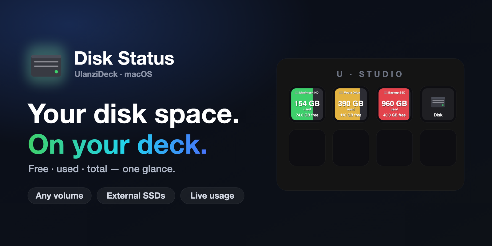
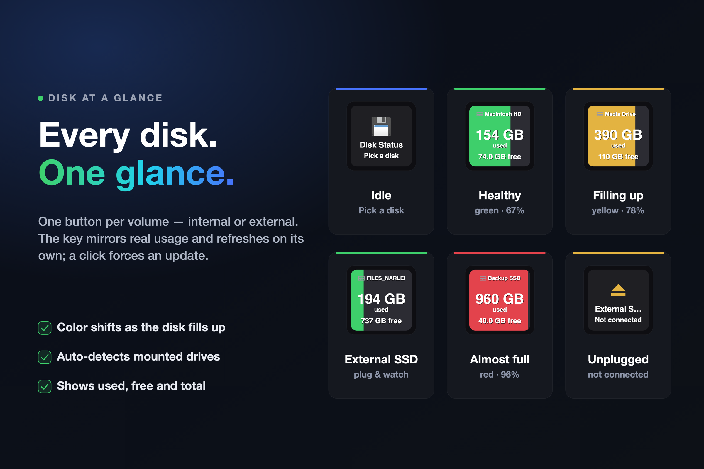
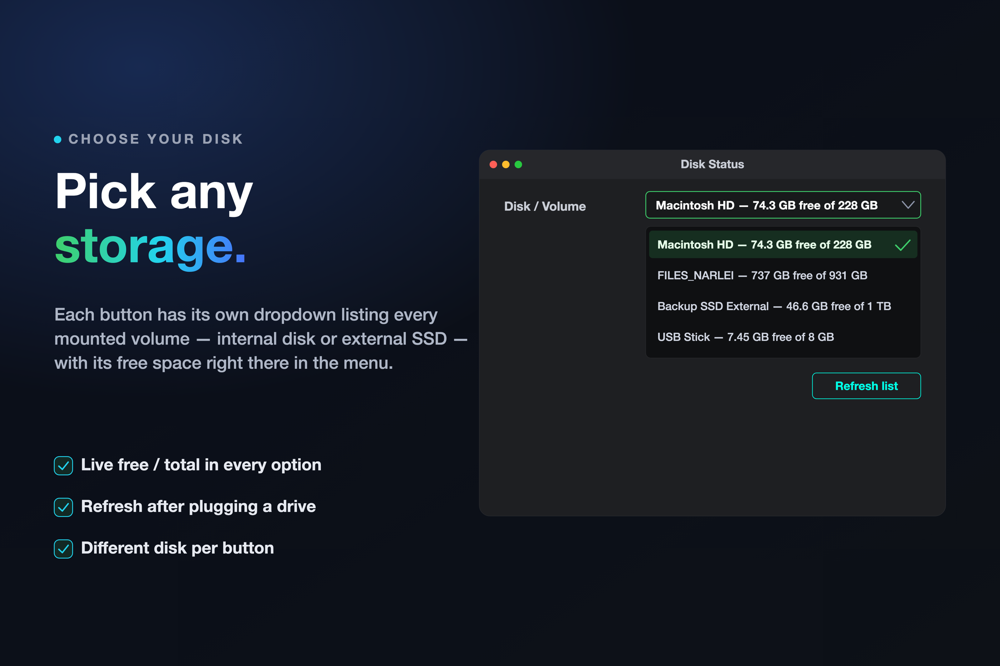

# Disk Status - Ulanzi Deck Plugin

**Your disk space — live on a physical button.**

Used, free and total for any drive you own — internal or external — on one smart key. No menu bar digging, no Finder.



[](https://ulanzicommunitystore.narlei.com)
[](LICENSE)
[]()
[]()
[]()

---

## Why this exists

You're mid-export, mid-download, or mid-build and you want to know — without breaking focus — how much room is left on your boot drive or that external SSD. Disk Status puts that number on a key in front of you: the amount in use, how much is still free, and a color that turns from green to red as the disk fills.

Each button watches one volume, so you can line up your internal disk and every external drive side by side.

---

## Install

**From the Ulanzi Community Store (recommended)**

Open the [Ulanzi Community Store](https://ulanzicommunitystore.narlei.com), search for **Disk Status**, and install. Ulanzi Studio picks it up automatically.

**Manual**

Download the latest `com.narlei.diskstatus.ulanziPlugin.zip` from [Releases](https://github.com/narlei/ulanzideck-disk-status/releases), unzip it into your Ulanzi plugins folder, and restart Ulanzi Studio:

```
~/Library/Application Support/Ulanzi/UlanziDeck/Plugins/
```

> **Requirements:** macOS or Windows · [Ulanzi Studio](https://www.ulanzi.com/pages/download) 3.0.11+. UlanziDeck ships its own Node, so there's nothing else to install.

---

## One button per disk

Drag the **Disk Status** button to your deck and pick a volume in its settings. The key shows how much space is used, how much is free, and a proportional bar whose color reflects how full the disk is. A click forces an immediate refresh.



| The button shows | Meaning |
|---|---|
| big **GB used** + **`X GB free`** | space in use, with what's still free below |
| 🟢 green bar | under 70% used |
| 🟡 yellow bar | 70–85% used |
| 🟠 orange bar | 85–95% used |
| 🔴 red bar | 95%+ — nearly full |
| 💾 **Pick a disk** | no volume selected yet |
| ⏏ **Not connected** | the chosen external drive is unplugged |

The bar grows left-to-right with usage, so you read the fill level at a glance without needing the percentage spelled out. Values refresh on their own and the instant you click.

---

## Pick any storage

Each button carries its own dropdown listing every mounted volume — your internal disk and any external SSD/HDD — with each option's free space and total right there in the menu. Set a different disk per button to watch several at once.



Plugged a drive in after opening the settings? Hit **Refresh list** and it appears. If a selected external drive is later unplugged, the button says **Not connected** instead of silently switching to another disk.

---

## How it stays fresh

The plugin polls the operating system for the selected volume every ~30 s (paused when the key isn't visible) and re-renders the button. A click forces an out-of-band refresh so the number is current the moment you look.

Disk data comes straight from the OS:

- **macOS / Linux** — `df` for capacity, plus `diskutil` for the boot volume's friendly name.
- **Windows** — `Get-Volume` via PowerShell.

> On modern macOS the boot volume `/` is a sealed, read-only system snapshot, so its raw "used" figure is misleading — Disk Status derives real usage from `total − free` for that volume, which matches what Finder reports.

---

## Privacy & security

- **No network, ever.** The plugin never makes a single network request. Everything is read locally from your own machine.
- **No analytics, no telemetry.** Nothing about your disks or usage is collected or transmitted anywhere.
- **No elevated permissions.** It only reads volume capacity the same way the OS reports it to any app.
- **Open source.** Every line is in this repo — audit it yourself.

---

## Development

```bash
git clone https://github.com/narlei/ulanzideck-disk-status
cd ulanzideck-disk-status
make install   # symlink into UlanziDeck + restart Ulanzi Studio
```

| Command | What it does |
|---|---|
| `make install` | Install (symlink) the plugin and restart Ulanzi Studio |
| `make package` | Build distributable ZIP → `dist/` |
| `make restart` | Restart Ulanzi Studio only |
| `make bump_patch` | Bump version (patch / minor / major) |

**Layout**

```
com.narlei.diskstatus.ulanziPlugin/   # the plugin bundle
├── plugin/            # app.js, disk-fetcher.js, renderer.js
│   └── plugin-common-node/            # UlanziDeck WebSocket client (Node)
├── property-inspector/                # inspector.html, inspector.js (disk picker)
├── libs/              # shared PI js/css/assets
├── resources/         # icon.png
├── tools/             # gen-banners.mjs (README art generator)
└── manifest.json / package.json
resources/                            # README art (cover + banners)
```

The button art is drawn as an SVG in `plugin/renderer.js`; disk enumeration lives entirely in `plugin/disk-fetcher.js`.

---

MIT © [Narlei Moreira](https://github.com/narlei)
